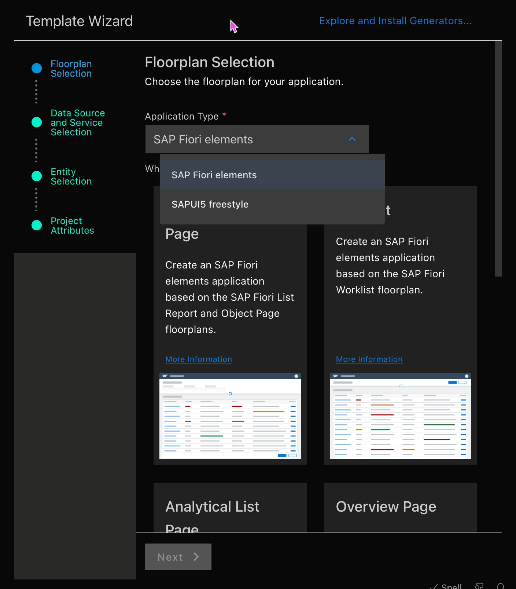
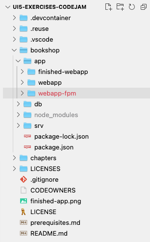
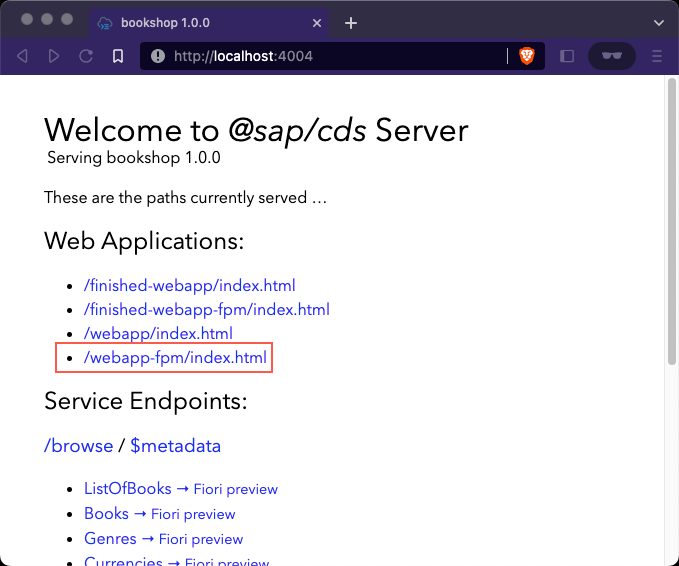
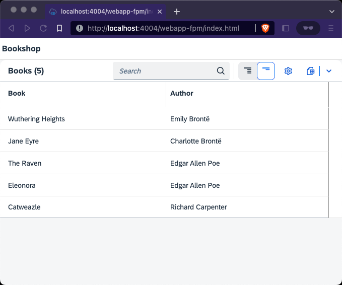

# Chapter 2.01 - Enabling the SAP Fiori Elements Flexible Programming Model

The following series of chapters (starting with this chapter101) introduces **SAP Fiori elements flexible programming model**, which bridges the gap between freestyle UI5 development and [SAP Fiori elements](https://ui5.sap.com/#/topic/03265b0408e2432c9571d6b3feb6b1fd).

The application we built so far in chapters 001 to 010 used a freestyle approach, meaning we built our own custom view with specific controls and controller logic. In contrast to that, SAP Fiori elements provide predefined [floorplans](https://ui5.sap.com/#/topic/797c3239b2a9491fa137e4998fd76aa7.html) (think "application layouts") for common business application use cases. Using this approach, the framework (SAPUI5) generates an application by interpreting metadata that is part of the consumed OData backend services. The specific parts of OData metadata that define the way a backend service is represented in frontend applications are called "annotations" and are mandatory when using SAP Fiori elements.

It is necessary to decide before starting to develop a new application which of the two approaches you want to use to build your application. The [SAP Fiori Tools](https://help.sap.com/docs/SAP_FIORI_tools/17d50220bcd848aa854c9c182d65b699/2d8b1cb11f6541e5ab16f05461c64201.html?locale=en-US) provide guided application generators for both approaches.



However, the situation is not exactly black and white, as the [SAP Fiori elements flexible programming model](https://sapui5.hana.ondemand.com/test-resources/sap/fe/core/fpmExplorer/index.html#/overview/introduction) provides building blocks (macros), which are metadata-driven UI controls that can be used in any (freestyle) SAPUI5 application. This flexible programming model is perfect for our use case, as we already have a working freestyle UI5 application and solely want to enhance it - while learning about SAP Fiori elements and OData annotations along the way. The instructions given in this chapter basically align with the [the official documentation](https://sapui5.hana.ondemand.com/test-resources/sap/fe/core/fpmExplorer/index.html#/buildingBlocks/guidance/guidanceCustomApps), but are more detailed and more specific to our use case.

At the end of this chapter we will have enabled the Fiori elements flexible programming model for our custom UI5 application.

## Steps

[1. Dublicate your existing application](#1-duplicate-your-existing-application)<br>
[2. Extend the `sap/fe/core/AppComponent` instead of the `sap/ui/core/UIComponent`](#2-extend-the-sapfecoreappcomponent-instead-of-the-sapuicoreuicomponent)<br>
[3. Add routing to the `app/webapp-fpm/manifest.json`](#3-add-routing-to-the-appwebapp-fpmmanifestjson)<br>
[4. Remove the `rootView` from the `app/webapp-fpm/manifest.json`](#4-remove-the-rootview-from-the-appwebapp-fpmmanifestjson)<br>
[5. Add dependencies to the `app/webapp-fpm/manifest.json`](#5-add-dependencies-to-the-appwebapp-fpmmanifestjson)<br>
[6. Use SAPUI5 instead of OpenUI5](#6-use-sapui5-instead-of-openui5)<br>
[7. Rebuild the `app/webapp-fpm/view/App.view.xml`](#7-rebuild-the-appwebapp-fpmviewappviewxml)<br>
[8. Use the `sap/fe/core/PageController` instead of the `sap/ui/core/mvc/Controller`](#8-use-the-sapfecorepagecontroller-instead-of-the-sapuicoremvccontroller)<br>
[9. Add OData annotations](#9-add-odata-annotations)<br>
[10. Test the new app](#10-test-the-new-app)<br>


### 1. Duplicate the existing application

➡️ Duplicate your existing UI5 application living in `app/webapp/` into a new `app/webapp-fpm/` directory.



We dublicated our existing application to preserve the progress we made in the previous chapters. The structural changes we are about to make to our application require us to delete parts of the application (and thus the progress we made).

### 2. Extend the `sap/fe/core/AppComponent` instead of the `sap/ui/core/UIComponent`

➡️ Replace the content of the existing `app/webapp-fpm/Component.js` with the following code:

```javascript
sap.ui.define([
    "sap/fe/core/AppComponent",
], function (AppComponent) {
    "use strict"
    return AppComponent.extend(
        "sap.codejam.Component", {
            metadata : {
                "interfaces": [
                    "sap.ui.core.IAsyncContentCreation"
                    ],
                    manifest: "json"
            },
            init : function () {
                AppComponent.prototype.init.apply(
                    this,
                    arguments
                    )
            }
    })
})
```

We now use and extend the `sap/fe/core/AppComponent` instead of the `sap/ui/core/UIComponent` to make sure our [component](/chapters/chapter001/readme.md#4-create-an-appwebappcomponentjs-file) runs within the SAP Fiori elements framework.


### 3. Add routing to the `app/webapp-fpm/manifest.json`

➡️ Add the following code to the `sap.ui5` section of the `app/webapp-fpm/manifest.json`:

```json
"routing": {
    "routes": [
        {
            "pattern": ":?query:",
            "name": "mainPage",
            "target": "mainPage"
        }
    ],
    "targets": {
        "mainPage": {
            "type": "Component",
            "id": "mainPage",
            "name": "sap.fe.core.fpm",
            "options": {
                "settings": {
                    "viewName": "sap.codejam.view.App",
                    "entitySet": "Books",
                    "navigation": {}
                }
            }
        }
    }
},
```

We added a new `sap.ui5.routing` section to our application descriptor file in which we define all `routes` (think "pages") our application contains. Currently we have just one route and target, but that will change shortly. Let's go through the additions step by step:

- We describe a `pattern` for our route, which allows us to access it by attaching it to the URL of our application.
- Our route also has a `name` and a `target`, which points to the `mainPage` object we define in the `targets` section.
- The `targets` section is where we provide content information for the pages of our app. If we where to follow a freestyle UI5 approach, we could directly point to an xml file at this point, but within the SAP Fiori elements framework we specify the type as `Component` and use `sap.fe` templates for the pages.
- For our `mainPage` we use the `sap.fe.core.fpm` template component, which allows us to point to our own `sap.codejam.view.App` xml view, but have it run inside the SAP Fiori elements flexible programming model. We define the main `entitySet` (coming from the backend OData service) we want to use on the page. We leave the `navigation` section empty for now, as we currently only have one route.

### 4. Remove the `rootView` from the `app/webapp-fpm/manifest.json`

➡️ Remove the entire `rootView` section (inside `sap.ui5`) from the `app/webapp-fpm/manifest.json` file.

It was mandatory to remove the `rootView` from our application descriptor as we now have a dedicated `sap.ui5.routing` section and want the SAP Fiori elements framework to handle the routing, including embedding our views.

### 5. Add dependencies to the `app/webapp-fpm/manifest.json`

➡️ Add the following code to the `sap.ui5.dependencies.libs` section of the `app/webapp-fpm/manifest.json`:

```json
"sap.fe.templates": {},
"sap.fe.macros": {},
```

We added SAP Fiori elements related libraries to our dependencies to make sure they are preloaded by the SAPUI5 (performance optimizations) and are available at runtime.

This is what our `app/webapp-fpm/manifest.json` now looks like:

```json
{
    "sap.app": {
        "id": "codejam",
        "type": "application",
        "title": "CodeJam Bookshop",
        "applicationVersion": {
            "version": "1.0.0"
        },
        "dataSources": {
            "capService": {
                "uri": "/browse/",
                "type" : "OData",
                "settings" : {
                    "odataVersion" : "4.0"
                }
            }  
        }
    },
    "sap.ui5": {
        "dependencies": {
			"minUI5Version": "1.60.0",
			"libs": {
                "sap.ui.core": {},
                "sap.m": {},
                "sap.fe.macros": {},
                "sap.fe.templates": {}
			}
		},
        "routing": {
            "routes": [
                {
					"pattern": ":?query:",
					"name": "mainPage",
					"target": "mainPage"
				}
            ],
            "targets": {
                "mainPage": {
					"type": "Component",
					"id": "mainPage",
					"name": "sap.fe.core.fpm",
					"options": {
						"settings": {
                            "viewName": "sap.codejam.view.App",
							"entitySet": "Books",
							"navigation": {}
						}
					}
				}
            }
        },
        "models": {
            "": {
				"dataSource": "capService",
				"settings": {
					"synchronizationMode": "None",
					"operationMode": "Server",
					"autoExpandSelect": true,
					"earlyRequests": true
				}
			},
            "i18n": {
                "type": "sap.ui.model.resource.ResourceModel",
                "settings": {
                    "bundleName": "sap.codejam.i18n.i18n"
                }
            }
        },
        "resources": {
            "css": [
                {
                    "uri": "css/style.css"
                }
            ]
        }
    }
}
```

### 6. Use SAPUI5 instead of OpenUI5

➡️ Replace `openui5` with `sapui5` in the `app/webapp-fpm/index.html` so the bootstrapping (the script tag) looks like this:

```html
<script
    id="sap-ui-bootstrap"
    src="https://sapui5.hana.ondemand.com/resources/sap-ui-core.js"
    data-sap-ui-theme="sap_horizon"
    data-sap-ui-async="true"
    data-sap-ui-libs="sap.m"
    data-sap-ui-compatVersion="edge"
    data-sap-ui-oninit="module:sap/ui/core/ComponentSupport"
    data-sap-ui-resourceroots='{
        "sap.codejam": "./"
    }'>
</script>
```

We moved from OpenUI5 to SAPUI5, because SAP Fiori elements are not available and not part of OpenUI5. Check the [base readme](/README.md#sapui5-vs-openui5) to learn more about the differences between SAPUI5 and OpenUI5.

### 7. Rebuild the `app/webapp-fpm/view/App.view.xml`

➡️ Replace the content of the `app/webapp-fpm/view/App.view.xml` with the following code:

```xml
<mvc:View
    xmlns="sap.m"
    xmlns:mvc="sap.ui.core.mvc"
    controllerName="sap.codejam.controller.App"
    xmlns:macros="sap.fe.macros">

<App id="Main">
    <pages>
        <Page title="{i18n>Bookshop}">
            <content>
                <macros:Table metaPath="@com.sap.vocabularies.UI.v1.LineItem" id="booksTable" />
            </content>
        </Page>
    </pages>
</App>

</mvc:View>
```

We removed almost all the content of our app view and replaced it with a `<macros:Table />`, which is a so called **building block** that we can use in SAP Fiori elements flexible programming model enabled applications. We pass it a `metaPath` pointing to specific **OData annotations** using the [SAP UI vocabulary](https://github.com/SAP/odata-vocabularies/blob/main/vocabularies/UI.md). As described [earlier](/chapters/chapter101/readme.md#chapter-101---sap-fiori-elements-flexible-programming-model), annotations are mandatory when using SAP Fiori elements, but they don't exist just yet - we will implement them shortly.

### 8. Use the `sap/fe/core/PageController` instead of the `sap/ui/core/mvc/Controller`

➡️ Replace the content of the `app/webapp-fpm/controller/App.controller.js` with the following code:

```javascript
sap.ui.define([
    "sap/fe/core/PageController"
], function (PageController) {
    "use strict"
    return PageController.extend("sap.codejam.controller.App", {})
})
```

Similar to what we did in [step 3](/chapters/chapter101/readme.md#2-extend-the-sapfecoreappcomponent-instead-of-the-sapuicoreuicomponent) we now use the `PageController` provided by SAP Fiori elements instead of the core UI5 controller. This is to make sure our controller code runs within the SAP Fiori elements framework and has access to its [extension APIs](https://ui5.sap.com/#/api/sap.fe.core.PageController%23methods/getExtensionAPI). The `sap/fe/core/PageController` itself extends the `sap/ui/core/mvc/Controller`.

### 9. Add OData annotations

➡️ Create the following `app/cat-service.cds` file:

```cds
using {CatalogService} from '../srv/cat-service';

annotate CatalogService.Books with @(
    UI: {
        LineItem: [
            {
                $Type: 'UI.DataField',
                Label: 'Book',
                Value: title
            },
            {
                $Type: 'UI.DataField',
                Label: 'Author',
                Value: author
            },
            {
                $Type: 'UI.DataField',
                Label: 'Genre',
                Value: genre.name
            },
            {
                $Type: 'UI.DataField',
                Label: 'Price',
                Value: price
            },
            {
                $Type: 'UI.DataField',
                Label: 'Stock',
                Value: stock
            }
        ]
    }
);
```

We added CDS based OData annotations to our project, which is one of the superpowers of the SAP Cloud Application Programming Model. It automatically picks up and reads our newly created annotations file and serves the provided information in the service metadata document (`http://localhost:4004/browse/$metadata`). This is the document our SAP Fiori elements application interprets and uses to build the UI. Let's go through our annotations step by step:

- We import our `CatalogService` from the `srv/` directory and annotate its `Books` entity.
- We use the [UI vocabulary](https://github.com/SAP/odata-vocabularies/blob/main/vocabularies/UI.md) developed by SAP to describe how we want our entity to be displayed in user interfaces. Generally a vocabulary is a collection of terms we can use to describe and give meaning to OData services.
- We describe a `LineItem`, which is a collection (array) of data fields (think "columns") suitable to be visualized in a table or list.
- The objects of the `LineItem` array are of type `UI.DataField` and therefore simply represent a piece of data. Each data field (think "column") has a `Label` and a `Value`, the latter comes directly from our Books entity.

You can learn more about the structure of annotations in this [document](https://github.com/SAP-samples/odata-basics-handsonsapdev/blob/annotations/bookshop/README.md).

### 10. Test the new app

➡️ Restart the CAP server in case it is not running (`npm run dev`) and go to [http://localhost:4004/webapp-fpm/index.html](http://localhost:4004/webapp-fpm/index.html) in your browser.





We enabled the SAP Fiori elements flexible programming model for our custom SAPUI5 application and use the Table building block, powered by OData annotations. You might have to resize your browser window to see all the columns of the Table. We will continue to fine tune and work on our application in the following chapters.

Continue to [Chapter 2.02 - Adding an Object Page](/chapters/2.02-object-page/)