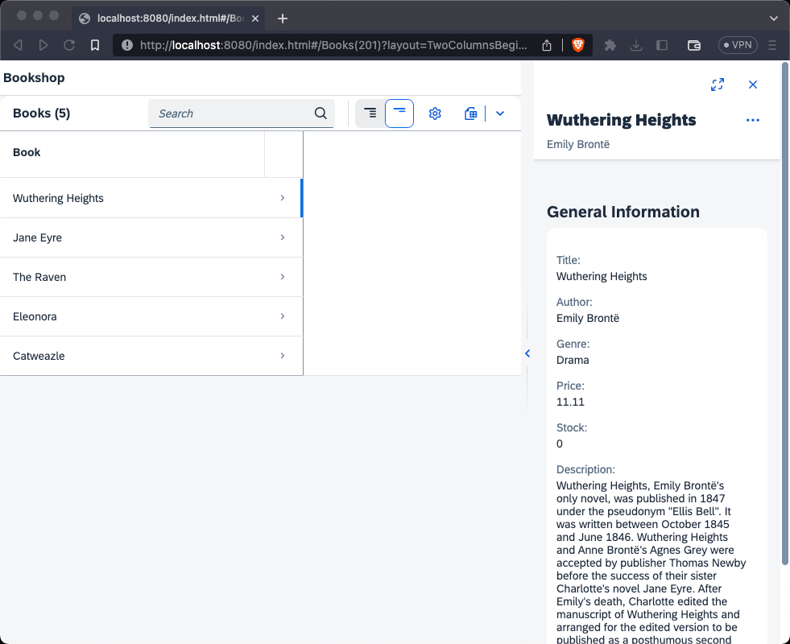

# Chapter 2.03 - Using the SAP Fiori Tools

At the end of this chapter you will have made our application visible to the SAP Fiori Tools and have used them. The [SAP Fiori Tools](https://marketplace.visualstudio.com/items?itemName=SAPSE.sap-ux-fiori-tools-extension-pack) are available both vor VS Code and the SAP Business Application Studio, and are the tooling of choice whenever we work with SAP Fiori Elements based applications.

## Steps

[1. Move app content into `webapp-fpm/webapp/` directory](#1-move-app-content-into-webapp-fpmwebapp-directory)<br>
[2. Add `@sap/ux-specification` as dependency](#2-add-sapux-specification-as-dependency)<br>
[3. Add `sapux` to `package.json`](#3-add-sapux-to-packagejson)<br>
[4. Install the SAP Fiori Tools](#4-install-the-sap-fiori-tools)<br>
[5. Work with the SAP Fiori Tools Page Map](#5-work-with-the-sap-fiori-tools-page-map)<br>
[6. Test the new layout](#6-test-the-new-layout)<br>

### 1. Move app content into `webapp-fpm/webapp/` directory

The SAP Fiori Tools expect our application to live in a `webapp/` directory. As this conflicts with our application we built in part 1, we will create a `webapp/` subdirectory inside the `webapp-fpm/` directory and move our app content there.

➡️ Create a new `webapp-fpm/webapp/` directory and move all the application content there.

This what our project's structure now looks like:

```text
- bookshop/
    + node_modules/
    + webapp/
    + webapp-fpm/
      - webapp/
        + controller/
        + css/
        + i18n/
        + view/
        - Component.js
        - index.html
        - manifest.json
    - manifest.yaml
    - package-lock.json
    - package.json
    - ui5.yaml
    - xs-app.json
```

### 2. Add `@sap/ux-specification` as dependency

The `@sap/ux-specification` package is required by the SAP Fiori Tools. It provides the necessary SAP Fiori Elements template structure information for the UI5 version we are using. It is important to install the correct version, matching the version [we define in the bootstrapping](/chapters/2.01-fe-fpm/readme.md#8-use-sapui5-instead-of-openui5).

➡️ Run the following command in the `bookshop/` directory:

```bash
npm install @sap/ux-specification@UI5-1.108 --save-dev
```

### 3. Add `sapux` to `package.json`

As our `webapp/` directory doesn't sit in the root of the `bookshop/`, we have to specify the path to it, so the SAP Fiori Tools know where to find the application.

➡️ Add the following block of code to the `package.json`:

```json
,
"sapux": [ "webapp-fpm" ]
```

### 4. Install the SAP Fiori Tools

If you are working in the SAP Business Application Studio, you already have the SAP Fiori Tools, but if you are working in VS Code, you have to install them manually.

➡️ Go to the extension marketplace, search for `sap fiori tools extension pack` and install the first extension that comes up.

### 5. Work with the SAP Fiori Tools Page Map

We can now test and use the SAP Fiori Tools, more specifically the Page Map.

➡️ Open the SAP Fiori Tools Page Map via the built-in Command Palette by searching for the term `Page Map`. Then select the Flexible Column Layout:


The SAP Fiori Tools Page Map shows the overall structure of our application and allows us to edit it. We selected the Flexible Column Layout, and the corresponding code was automatically added to our the `webapp-fpm/webapp/manifest.json` by the SAP Fiori Tools.

### 6. Test the new layout

➡️ Refresh the application in the browser and select a book. The app should app have the Flexible Column Layout:



Wow, you have made it all the way through this CodeJam content, congratulations! 🎉 

We would really appreciate if you took the time to [leave feedback](https://github.com/SAP-samples/ui5-exercises-codejam/issues/new?assignees=&labels=feedback&template=session-feedback-template.md&title=Session+Feedback) for this session/content, thank you!

You should feel confident enough to start developing your own UI5 applications now, whether it be freestyle or with the SAP Fiori Elements approach. If not, feel free to ask questions or raise concerns via a GitHub issue in this repository.


