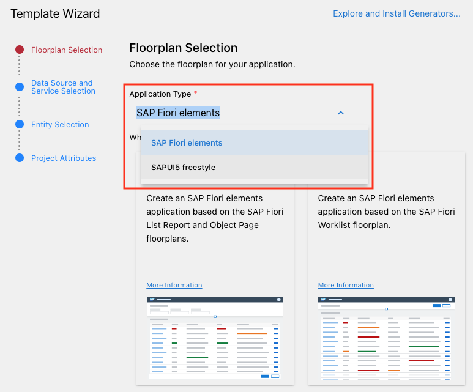

# Chapter 101 - SAP Fiori Elements Flexible Programming Model

The following series of chapters (starting with this chapter101) introduces **SAP Fiori elements flexible programming model**, which bridges the gap between freestyle UI5 development and [SAP Fiori elements](https://ui5.sap.com/#/topic/03265b0408e2432c9571d6b3feb6b1fd).

The application we built so far in chapters 001 to 010 used a freestyle approach, meaning we built our own custom view with specific controls and controller logic. In contrast to that, SAP Fiori elements provide predefined [floorplans](https://ui5.sap.com/#/topic/797c3239b2a9491fa137e4998fd76aa7.html) (think "application layouts") for common business application use cases. Using this approach, the framework (SAPUI5) generates an application by interpreting metadata that is part of the consumed OData backend services. The specific parts of OData metadata that define the way a backend service is represented in frontend applications are called "annotations" and are mandatory when using SAP Fiori elements.

It is necessary to decide before starting to develop a new application which of the two approaches you want to use to build your application. The [SAP Fiori Tools](https://help.sap.com/docs/SAP_FIORI_tools/17d50220bcd848aa854c9c182d65b699/2d8b1cb11f6541e5ab16f05461c64201.html?locale=en-US) provide guided application generators for both approaches.



However, the situation is not exactly black and white, as the SAP Fiori elements flexible programming model provides building blocks (macros), which are metadata-driven UI controls that can be used in any (freestyle) SAPUI5 application. This flexible programming model (FPM) is perfect for our use case, as we already have a working freestyle UI5 application and solely want to enhance it - while learning about SAP Fiori elements and OData annotations along the way. 

At the end of this chapter we will have enabled the Fiori Elements Flexible Programming Model for our custom UI5 application.

## Steps

[1. Extend the `sap/fe/core/AppComponent` instead of the `sap/ui/core/UIComponent`](#1-extend-the-sapfecoreappcomponent-instead-of-the-sapuicoreuicomponent)<br>
[2. Add an `itemSelected` property to the `userSelection` model](#2-add-an-itemselected-property-to-the-userselection-model)<br>
[3. Add an `enabled` attribute to the order `<Button />` and `<StepInput />`](#3-add-an-enabled-attribute-to-the-order-button--and-stepinput)<br>
[4. Inspect and test the new formatting](#4-inspect-and-test-the-new-formatting)<br>

### 1. Duplicate your existing application

Duplicate your existing UI5 application to

### 1. Extend the `sap/fe/core/AppComponent` instead of the `sap/ui/core/UIComponent`

➡️ Replace the `<Text />` control for the `stock` in the `<ColumnListItem />`  in our `app/webapp/view/App.view.xml` with the following control:

```xml
<ObjectStatus 
    text="{stock}"
    state="{=
        ${stock} >= 20
            ? 'Success'
        : ${stock} > 0
            ? 'Warning'
        : 'Error'}" />
```

This is what our view now looks like (a few controls collapsed in the screen shot):


We replaced the `<Text />` control with an `<ObjectStatus />` which allows us to set a `state` attribute. For the state we use a concept called ***formatting***. 'Formatting' means that we style our content based on conditions. The code for our `state` attribute looks complicated, because it is written as an inline if-statement, but translating it into pseudo code makes it a lot more readable:

```text
is the stock higher or equal to 20?
    if yes: set state to 'Success'
    if no: is the stock is higher than 0?
        if yes: set state to 'Warning'
        if no: set state to 'Error'
```


Continue to [Chapter 7 - Adding i18n Features](/chapters/chapter07)
